name: inverse
layout: true
class: center, middle, inverse
---
# <span style="font-size: 30%">Monaca × ニフクラ mobile backend</span><br>クラウドデータベースを<br>使ってみよう！
富士通クラウドテクノロジーズ株式会社

.right[]

.footnote[
2018/02/14作成（2021/01/12更新）
]

---
layout: true
class: center, middle, inverse_sub
---
# はじめに

---
layout: false

.footnote_right[
はじめに
]

## セミナー概要
__問い合わせフォーム__ をイメージしたサンプルアプリを通して、クラウドデータベースへの保存と検索の方法を学んでいきます

.center[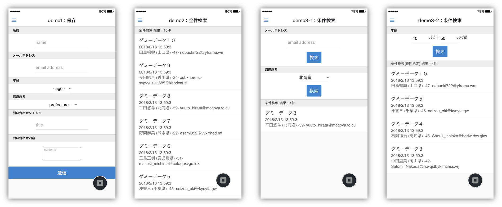]

---
.footnote_right[
はじめに
]

## データをクラウドに保存する<br>３つのメリット

.size_large_13[
1. 保存した瞬間、瞬時にデータを共有できる
1. 機種変更やアプリをアンインストールしても<br>データがなくならない
1. アプリにデータを持たないのでアプリの容量を軽くできる
]

.center[]

---
.footnote_right[
はじめに
]
## 今回習得できる内容
### クラウドデータベースの基本的な使い方
#### データの保存

.center[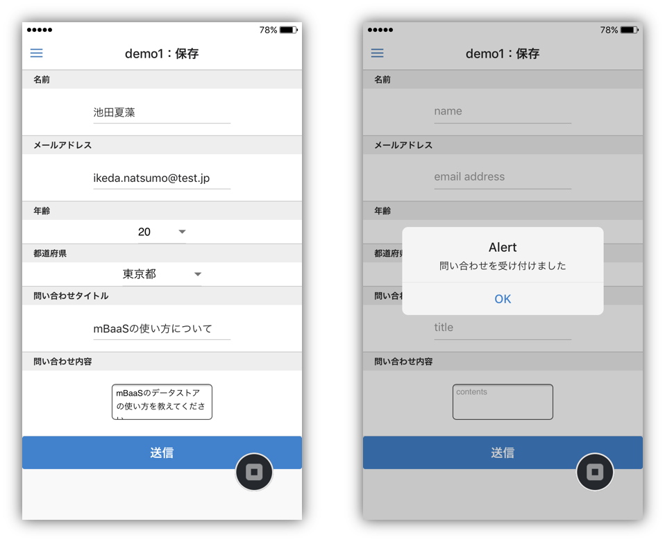]

---
.footnote_right[
はじめに
]
## 今回習得できる内容
### クラウドデータベースの基本的な使い方
#### データの取得

.center[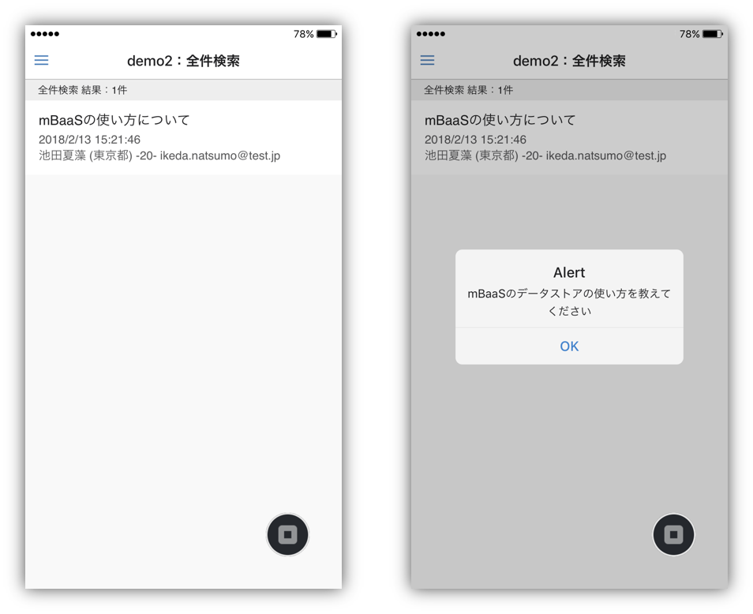]

---
.footnote_right[
はじめに
]
## 今回習得できる内容
### クラウドデータベースの基本的な使い方
#### データの条件検索取得（完全一致検索・範囲指定検索）

.center[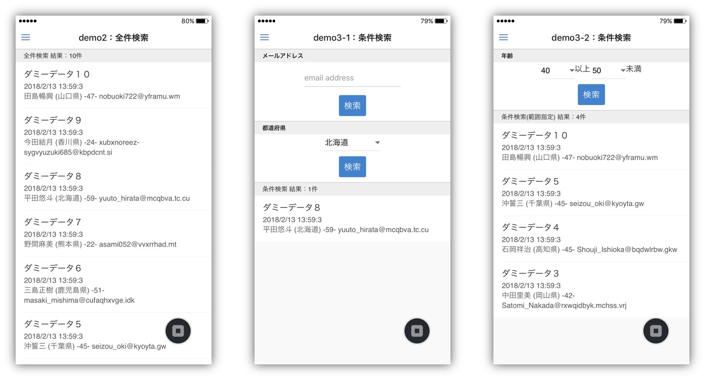]

---
.footnote_right[
はじめに
]
## 今回習得できる内容
### おまけ

* データの削除
* データの更新
* その他 ニフクラ mobile backned でできること

---
.footnote_right[
はじめに
]
## 今回利用するツール
### Monaca
* __もなか 【[Monaca](https://ja.monaca.io/)】__ HTML5/JavaScript/CSS3でスマホアプリが開発できる開発環境。開発スタイル／コーディング環境は選択可能。

.center[]

---
.footnote_right[
はじめに
]
## 今回利用するツール
### ニフクラ mobile backend
__にふくら-もばいる-ばっくえんど 【[ニフクラ mobile backend](https://mbaas.nifcloud.com/about.htm)】__ スマートフォンアプリに必要なバックエンド機能が開発不要で利用できるクラウドサービス。 クラウド上に用意された機能を API で呼び出すだけで利用できます。また、APIを簡単に使うための SDK を用意しています（ Swift / Objective-C / Android / Monaca / Unity ）。mobile Backend as a Service の頭文字を取って、通称 **mBaaS** と呼ばれます。

.center[]

---
.footnote_right[
はじめに
]

## 今回利用するツール
### Monaca と mobile backend で<br>サーバー連携アプリは簡単に実現可能に
この２つを組み合わせると、高度なアプリも簡単スピーディーに開発できます

.center[]

.left-column[
__《アプリ側》Monaca の利点__
.size_small_7[
* **無料** から使える！
* iOS / Android 同時に開発可能！
* いつでもどこでも、ブラウザで開発OK！
* **SDK導入** はクリックだけで簡単！
]
]
.right-column[
__《サーバー側》mobile backend の利点__
.size_small_7[
* **無料** から使える！
* **バックエンドの開発・運用は一切不要**！
* **コントロールパネル** からクラウドの状況をパッと確認できる！
]
]

---
layout: true
class: center, middle, inverse_sub
---
# ハンズオン

---
layout: false

.footnote_right[
ハンズオン
]

## 事前準備

.size_large_13[
* Monaca の利用登録（無料）
  * https://ja.monaca.io/register/start.html
* ニフクラ mobile backend の利用登録（無料）
  * https://mbaas.nifcloud.com/signup.htm
* ブラウザ Chrome 最新版
* Monaca デバッガー（任意）
  * https://ja.monaca.io/debugger.html
]

---
.footnote_right[
.right[
ハンズオン
]
]

## 取り組み内容
コーディング済みサンプルプロジェクトを利用します。必要な設定や作業後、すぐに動作確認いただけます。

### 1. 環境準備手順
.size_large_13[
1. Monaca の準備
  * サンプルプロジェクトのインポート
1. mobile backend の準備
  * アプリの新規作成
1. Monaca で mobile backend を利用するための準備
  * JavaScript SDK のインポート
  * JavaScript SDK の初期化（APIキー設定）
]

---
.footnote_right[
.right[
ハンズオン
]
]

### 2. 動作確認と解説

.size_large_11[
1. 『demo1：保存』
  * 問い合わせフォームに値を入力して保存してみましょう
1. 『demo2：全件検索』
  * 問い合わせデータをアプリ側に取得してみましょう
1. 『demo3：条件検索』（完全一致/～以上～未満）
  * 問い合わせデータを条件を指定して取得してみましょう
  * 問い合わせデータを範囲を指定して取得してみましょう
1. おまけ
  * データの削除
  * データの更新
  * その他 mobile backend でできること
]

---
.footnote_right[
.right[
ハンズオン<br>1.1. Monaca の準備
]
]

## 1.1. Monaca の準備
### サンプルプロジェクトのインポート

* Monaca にログインをします

.center[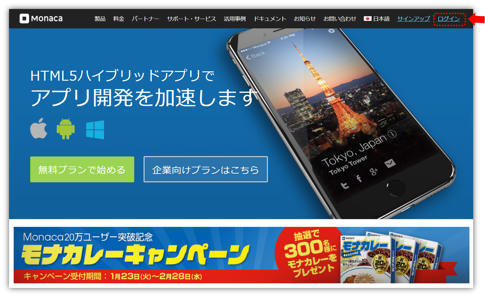]

https://ja.monaca.io/

---
.footnote_right[
.right[
ハンズオン<br>1.1. Monaca の準備
]
]

### サンプルプロジェクトのインポート

* プロジェクトをダウンロードします
  * 下記リンクをクリックし、プロジェクト（zip）をダウンロードします
  * https://github.com/natsumo/MonacaFormApp/archive/master.zip
* Monaca にプロジェクトをインポートします
  * 「インポート」をクリックし、インポート方法「ZIPファイル」を選択し、先ほどダウンロードしたzipファイルを選択します
  * プロジェクト情報を入力して「プロジェクトのインポート」をクリックします

.left-column[
* 作成されたプロジェクトを選択し、右側に表示される「クラウドIDEで開く」をクリックします
* プロジェクトが表示されます

これで Monaca の準備は完了です。
]
.right-column[
.center[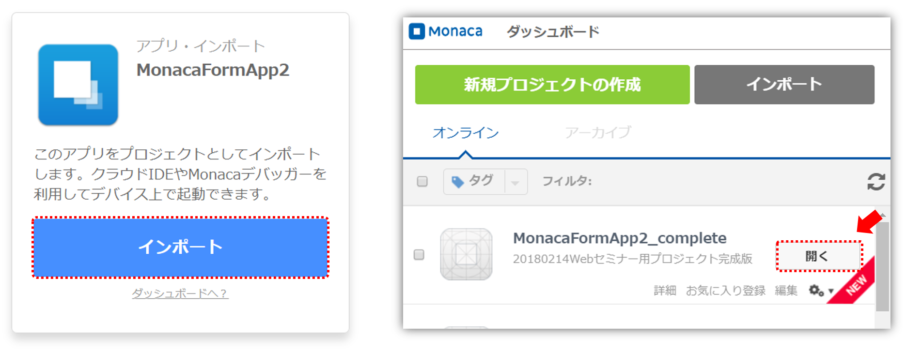]
]


---
.footnote_right[
.right[
ハンズオン<br>1.2. mobile backend の準備
]
]

## 1.2. mobile backend の準備
### アプリの新規作成

* mobile backend にログインします

.center[]

https://mbaas.nifcloud.com/

---
.footnote_right[
.right[
ハンズオン<br>1.2. mobile backend の準備
]
]

### アプリの新規作成
* 新しいアプリを作成します
* アプリ名を入力し「`新規作成`」をクリックします　例）.color_blue[__MonacaFormApp2__]

.center[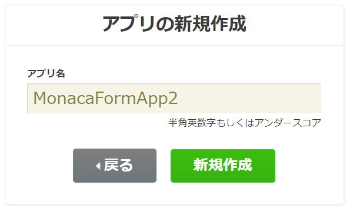]


* mobile backend を既に使用したことがある場合は、画面上方のメニューバーにある「`+新しいアプリ`」をクリックすると同じ画面が表示されます

.center[]

---
.footnote_right[
.right[
ハンズオン<br>1.2. mobile backend の準備
]
]

### アプリの新規作成
* アプリが作成されるとAPIキー（２種類）が発行されます
 * APIキーは後で使用します。
* ここでは使用しないので、「OK」で閉じます

.center[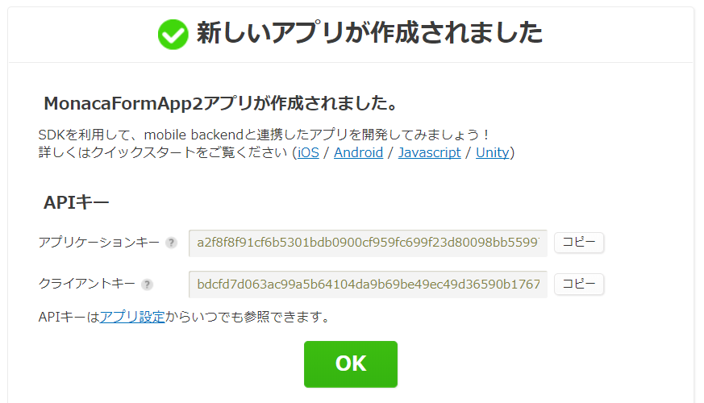]

---
.footnote_right[
.right[
ハンズオン<br>2. mobile backend 準備
]
]

### アプリの新規作成
* ダッシュボードが表示されます

.center[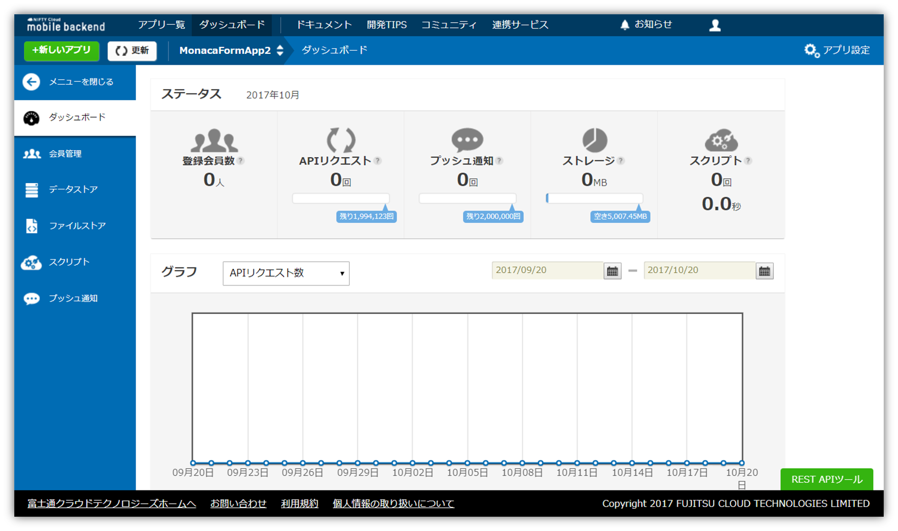]

 これで mobile backend の準備は完了です

---
.footnote_right[
.right[
ハンズオン<br>1.3. Monaca で mobile backend を利用するための準備
]
]

## 1.3. Monaca で mobile backend を利用するための準備
### JavaScript SDK のインポート
* Monaca を開きます
* `設定` ＞ `JS/CSSコンポーネントの追加と削除` をクリックます
* 右上の「 `コンポーネント名` 」に「 `ncmb` 」と入力して検索します

.center[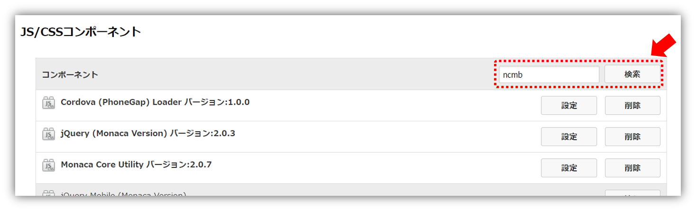]

---
.footnote_right[
.right[
ハンズオン<br>1.3. Monaca で mobile backend を利用するための準備
]
]

### JavaScript SDK のインポート
* 追加をクリックします

.center[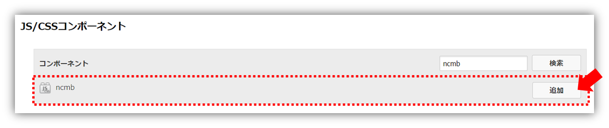]

* バージョンは最新（デフォルト）のまま `インストール` をクリックします
* チェックを入れ `保存する` をクリックします

.center[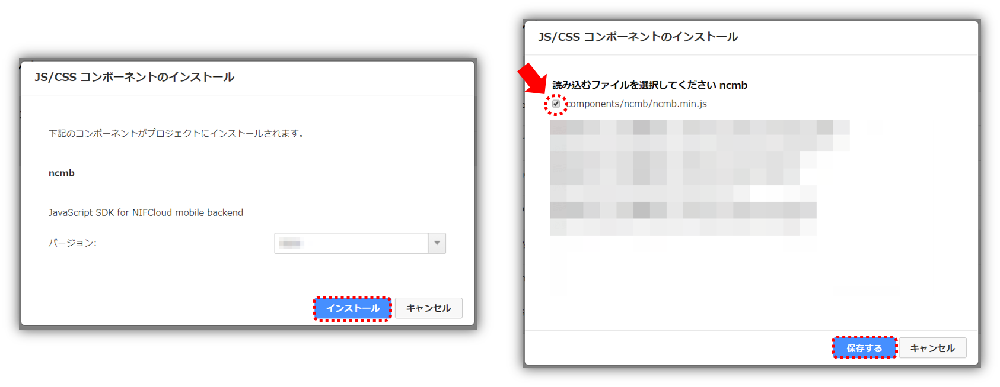]

---
.footnote_right[
.right[
ハンズオン<br>1.3. Monaca で mobile backend を利用するための準備
]
]

### JavaScript SDK のインポート
* SDK がインポートされました

.center[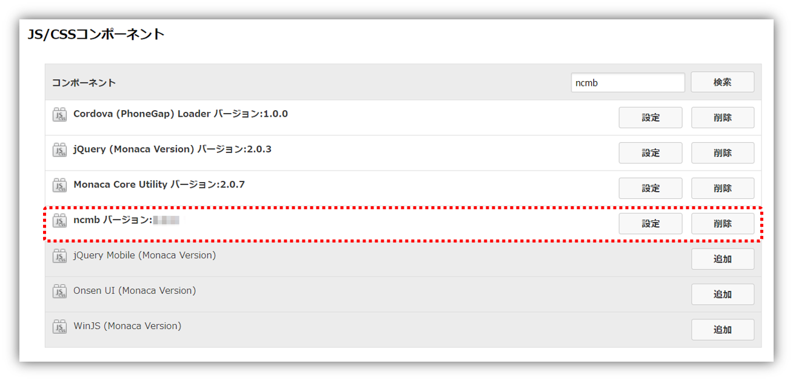]

---
.footnote_right[
.right[
ハンズオン<br>1.3. Monaca で mobile backend を利用するための準備
]
]

### JavaScript SDK の初期化（APIキーの読み込み）
* `js/mb.js` を開きます
* `YOUR_NCMB_APPLICATION_KEY` と `YOUR_NCMB_CLIENT_KEY` を mobile backend でアプリ作成時に発行された２つの APIキー （アプリケーションキーとクライアントキー）に貼り替えます

```js
// APIキー
var applicationKey = 'YOUR_NCMB_APPLICATION_KEY';
var clientKey = 'YOUR_NCMB_CLIENT_KEY';
```

* APIキーは mobile backend 管理画面の「アプリ設定」で確認できます

.center[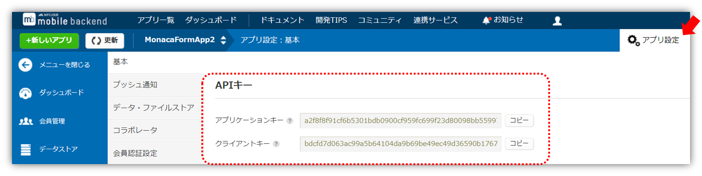]

---
.footnote_right[
.right[
ハンズオン<br>1.3. Monaca で mobile backend を利用するための準備
]
]

### JavaScript SDK の初期化（APIキーの読み込み）
* APIキー を設定することで、SDK が初期化され利用可能になります
  * `NCMB` は SDK を表しています

```js
// SDK初期化
var ncmb = new NCMB(applicationKey, clientKey);

```

これで準備はすべて完了しました。動作確認をしていきましょう。

---
.footnote_right[
.right[
ハンズオン<br>2.1. 『demo1：保存』
]
]

## 2.1. 『demo1：保存』

.left-column[
### 『demo1：保存』動作確認

Monaca デバッガーまたは<br>プレビュー画面で動作確認をします
* 名前から問い合わせ内容まで、問い合わせフォームすべてに入力してください
* 入力後画面下の「送信」ボタンをクリックします
]

.right-column[
.center[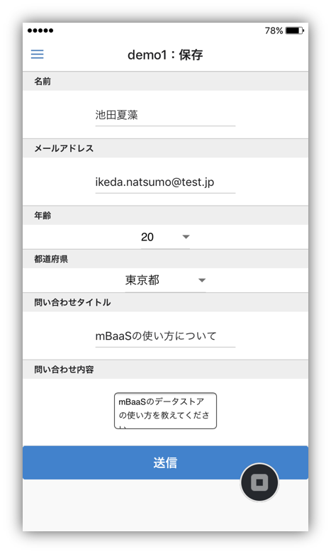]
]
---
.footnote_right[
.right[
ハンズオン<br>2.1. 『demo1：保存』
]
]

### 『demo1：保存』動作確認

* 確認 Alert が出れば保存成功です

.center[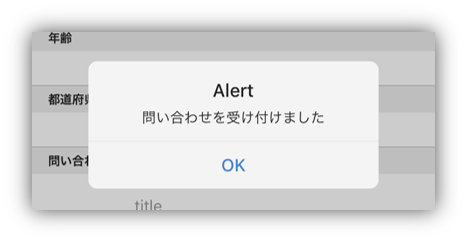]

.right[…本当にクラウドにデータが保存されているのでしょうか<br>確認してみましょう！]

---
.footnote_right[
.right[
ハンズオン<br>2.1. 『demo1：保存』
]
]

### 『demo1：保存』動作確認

保存されたデータを確認してみましょう！

* mobile backend を開きます
* `データストア` を開くと 「`Inquiry`」というクラスが作成されていて、その中にデータが格納されていることを確認できます

.center[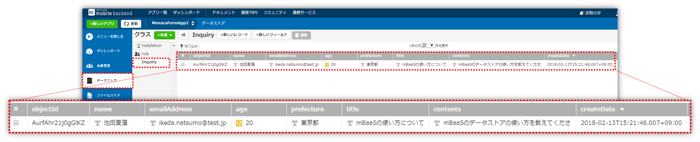]

.right[<br>…どのようにして保存されているのでしょうか？？<br>コードを見てみましょう！]

---
.footnote_right[
.right[
ハンズオン<br>2.1. 『demo1：保存』
]
]

### 『demo1：保存』動作確認

* Monaca を開き、`js/mb.js` を開きます

```js
/***** demo1：保存 *****/
saveData: function(data) { // 引数： [name, emailAddress, age, prefecture, title, contents]
    // 保存先クラスの作成
    var Inquiry = ncmb.DataStore('Inquiry');
    // インスタンスの生成
    var inquiry = new Inquiry();  
    // データの設定と保存
    inquiry.set('name', data[0]).set('emailAddress', data[1]).set('age', data[2])
           .set('prefecture', data[3]).set('title', data[4]).set('contents', data[5])
           .save()
           .then(function(results){
               // 保存成功
           })
           .catch(function(error){
               //保存失敗
           });
}
```

* `set(key, value)` : 値の設定
* `save()` : 保存処理

---
.footnote_right[
.right[
ハンズオン<br>2.2. 『demo2：全件検索』
]
]

## 2.2. 『demo2：全件検索』
### 『demo2：全件検索』動作確認

* demo1 画面から demo2 画面に移動します

.center[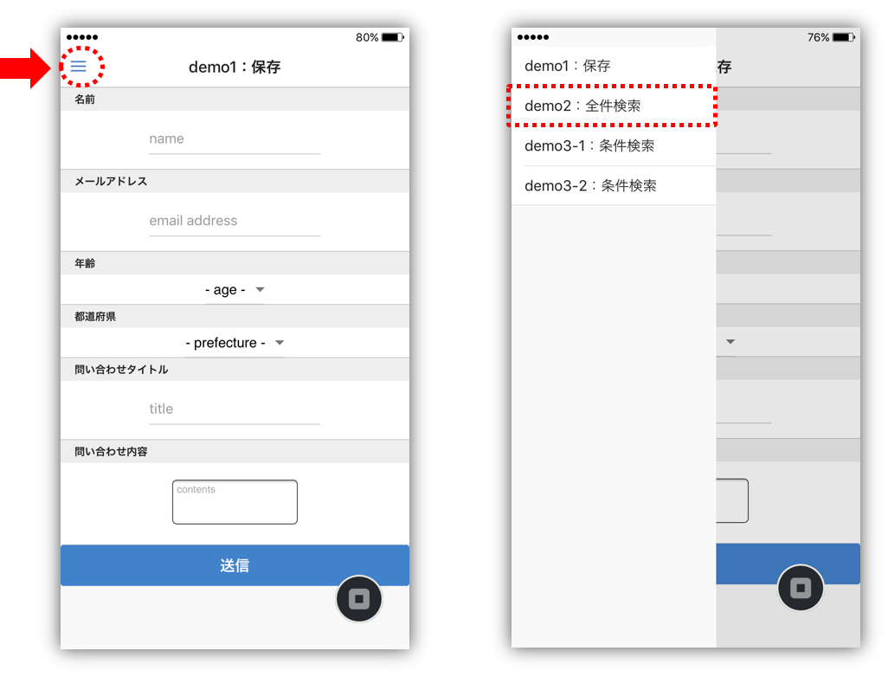]

---
.footnote_right[
.right[
ハンズオン<br>2.2. 『demo2：全件検索』
]
]

### 『demo2：全件検索』動作確認

.left-column[
* demo2 画面が表示されたタイミングで mobile backend から登録データを取得し、画面に表示するように実装しています
* この時点では１件しか登録していないので、登録された１件だけ表示されます
* demo1 画面から複数件登録してから、もう一度 demo2 を見てみましょう
]

.right-column[
.center[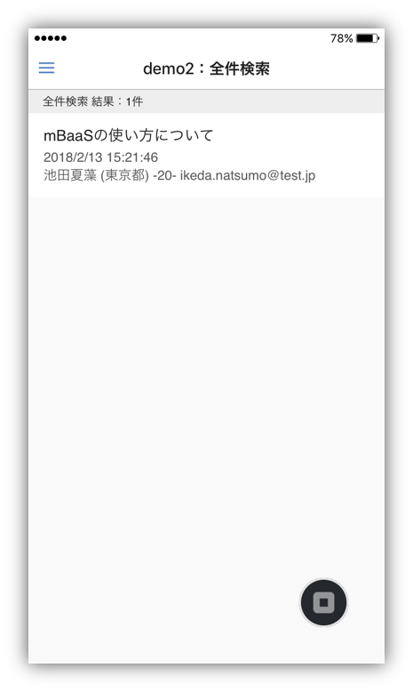]
]

---
.footnote_right[
.right[
ハンズオン<br>2.2. 『demo2：全件検索』
]
]

### 『demo2：全件検索』動作確認

.left-column[
* 例としてダミーデータを10件登録した場合はこんな感じになります
* 検索についてのコードも確認してみましょう！
]

.right-column[
.center[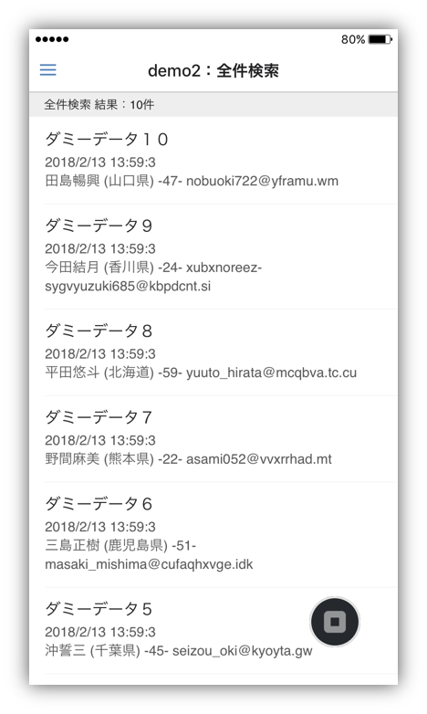]
]

---
.footnote_right[
.right[
ハンズオン<br>2.2. 『demo2：全件検索』
]
]

### 『demo2：全件検索』動作確認

* Monaca を開き、`js/mb.js` を開きます

```js
/***** demo2：全件検索 *****/
getAllData: function() {        
    // インスタンスの生成
    var inquiry = ncmb.DataStore('Inquiry');
    // データを全件検索取得
    inquiry.order('createDate',true) // 保存日時降順
            .fetchAll()
            .then(function(results){
                //全件取得成功理

            })
            .catch(function(error){
                //全件取得失敗

            });
}
```

* `order('createDate',true)` :  保存日時の降順を指定
* `fetchAll()` : 全件検索取得

---
.footnote_right[
.right[
ハンズオン<br>2.2. 『demo2：全件検索』
]
]

### 『demo2：全件検索』動作確認

* 参考：リスト表示は `js/app.js` の `setData()` メソッド内で処理をしています

.size_small_7[
```js
// 各ページのリストを生成
function setData(str, results, listId) {
    $(listId).empty();
    var count = results.length;
    // ヘッダー
    var dom = "<li class='list-header'>" + str + " 結果：" + count + "件</li>";
    // リストアイテム
    for (var i = 0; i < results.length; i++) {
        var object   = results[i];
        var title = object.get("title");
        var contents = object.get("contents");
        var name = object.get("name");
        var emailAddress = object.get("emailAddress");
        var age = object.get("age");
        var prefecture = object.get("prefecture");

        var createDate = object.get("createDate");
        var jstCreateDate = replaceTimeForm(createDate);

        dom = dom + "<li class='list-item list-item--material' style='text-align: left;' onClick='ons.notification.alert(\"" + contents + "\");'>";
        dom = dom + "<div class='list-item__center list-item--material__center'>";
        dom = dom + "<div class='list-item__title list-item--material__title'>" + title + "</div>";
        dom = dom + "<div class='list-item__subtitle list-item--material__subtitle'>";
        dom = dom + jstCreateDate + "<br>" + name + " (" + prefecture + ") -" + age + "- " + emailAddress;
        dom = dom + "</div></div></li>";
    }

    $(listId).append(dom);
}
```
* `object.get(key)` : NCMBObject から値を取り出す

]

---
.footnote_right[
.right[
ハンズオン<br>2.3. 『demo3：全件検索』
]
]

## 2.3. 『demo3：条件検索』
### 『demo3-1：条件検索』（完全一致）動作確認

.size_small_9[
* 左上メニューから demo3-1 に移動します
* 登録したデータからメールアドレスまたは都道府県を指定してデータを検索取得します
]

.center[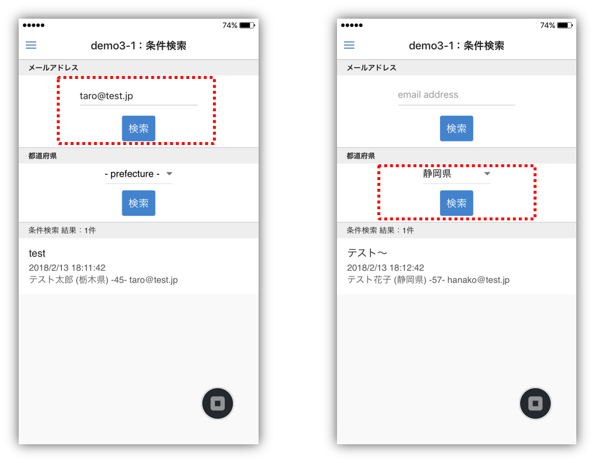]

---
.footnote_right[
.right[
ハンズオン<br>2.3. 『demo3：全件検索』
]
]

### 『demo3-1：条件検索』（完全一致）動作確認

* **完全一致** 検索になるので以下のような検索はできません

.center[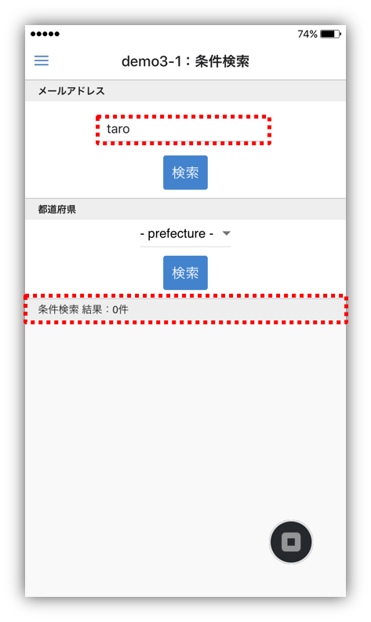]

* 部分一致検索が必要な場合は、アプリ内で実装が必要です
* コードを見てみましょう！

---
.footnote_right[
.right[
ハンズオン<br>2.3. 『demo3：全件検索』
]
]

### 『demo3-1：条件検索』（完全一致）動作確認

* Monaca を開き、`js/mb.js` を開きます

```js
/***** demo3-1：条件検索 *****/
getSearchData: function(feild, inputData) { //引数1 prefecture or emailAddress, 引数2 入力値
    // インスタンスの生成
    var inquiry = ncmb.DataStore('Inquiry');
    // データの条件検索取得（完全一致）
    inquiry.order('createDate',true)
           .equalTo(feild, inputData)
           .fetchAll()
           .then(function(results){
               // 検索成功
           })
           .catch(function(error){
               // 検索失敗
           });
}
```

* `equalTo(key, value)` : key の値が value と一致するデータを指定
* `fetchAll()` : 全件検索取得する処理

---
.footnote_right[
.right[
ハンズオン<br>2.3. 『demo3：全件検索』
]
]

### 『demo3-2：条件検索』（～以上～未満）動作確認

* 左上メニューから demo3-2 に移動します
* 登録したデータから年齢の範囲を指定してデータを検索取得します

.center[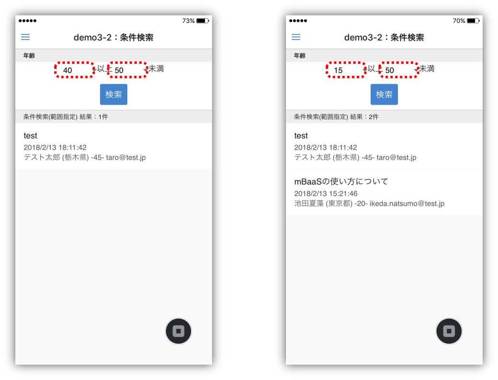]

---
.footnote_right[
.right[
ハンズオン<br>2.3. 『demo3：全件検索』
]
]

### 『demo3-2：条件検索』（～以上～未満）動作確認

* コードを見てみましょう
* Monaca を開き、`js/mb.js` を開きます

```js
/***** demo3-2：条件検索（範囲指定） *****/
getRangeSearchData: function(feild, inputDataGreaterThan, inputDataLessThan) { //引数1 age, 引数2,3 入力値
    // インスタンスの生成
    var inquiry = ncmb.DataStore('Inquiry');
    // データのの条件検索取得（範囲指定）
    inquiry.order('createDate',true) // 保存日時降順
           .greaterThanOrEqualTo(feild, inputDataGreaterThan)
           .lessThan(feild, inputDataLessThan)
           .fetchAll()
           .then(function(results){
               // 検索成功
           })
           .catch(function(error){
               // 検索失敗
           });
}
```

.size_small_9[
* `greaterThanOrEqualTo(key, value)` : key の値が value 以上に該当するデータを指定
* `lessThan(key, value)` : key の値が value 未満に該当するデータを指定
]

---
.footnote_right[
.right[
ハンズオン<br>2.3. 『demo3：全件検索』
]
]

### 『demo3-2：条件検索』（～以上～未満） 参考
**AND検索（A かつ B）**

```js
// 10以上50未満
inquiry.greaterThanOrEqualTo("age", 10)
       .lessThan("age", 50)
       .fetchAll()
```
* メソッドチェーンでつないで記述します

**OR検索（A または B）**

```js
// 10未満または50以上
var subquery1 = inquiry.lessThan("age", 10);
var subquery2 = inquiry.greaterThanOrEqualTo("age", 50);
inquiry.or([subquery1, subquery2])
       .fetchAll()
```
* サブクエリを作成して `or` メソッドで合成します

---
.footnote_right[
.right[
ハンズオン<br>2.4. おまけ
]
]

## 2.4. おまけ
### データの削除

```js
// データの削除
inquiry.delete()
```

### データの更新

```js
// メールアドレスの更新
inquiry.set("emailAddress", "test@test.jp")
       .update();
```

---
.footnote_right[
.right[
ハンズオン<br>2.4. おまけ
]
]

### その他 mobile backend でできること
#### データストアの機能
* **ポインタ・リレーション**
  * データ同士を関連付けすることができます
* **参照権限（ACL）**
  * データの読み書きを制限できます

参考：[データストア \(Monaca\) : 基本的な使い方 \| ニフクラ mobile backend](https://mbaas.nifcloud.com/doc/current/datastore/basic_usage_monaca.html)
---
.footnote_right[
.right[
まとめ
]
]

## まとめ


ニフクラ mobile backend クラウドデータベースの活用方法を学びました！

.left-column[

.size_large_11[
* データの保存
  * クラス作成
  * `set()`
  * `save()`
* データの取得
  * `order()`
  * `fetchAll()`
* データの条件検索
  * `equalTo()`
  * `greaterThanOrEqualTo()`
  * `lessThan()`
]
]

.right-column[
.right[
<br>
今後のアプリ開発の<br>参考にしていただけたら幸いです！


.size_small_7[
ニフクラ mobile backend イメージキャラクター<br>タカノくん
]
]
]


---
layout: true
class: center, middle, inverse_sub
---
# おわりに

---
layout: false

.footnote_right[
.right[
おわりに
]
]

## おわりに
使いやすくて便利な mobile backend をもっと活用してみたい方へ、mobile backendの各機能をすぐに試すことができるサンプルアプリを多数ご用意しています。Monacaにサンプルプロジェクトをインポートして、簡単な操作をするだけですぐにお試しいただけます！ぜひご活用ください。

.size_large_11[
* [mobile backend を体験しよう！](https://github.com/NIFCLOUD-mbaas/monaca_data_registration)
 * 使用機能 / データストア
* [アプリにログイン機能をつけよう！](https://github.com/NIFCLOUD-mbaas/monaca_login_template)
 * 使用機能 / 会員管理
* [アプリにプッシュ通知を組み込もう！](https://github.com/NIFCLOUD-mbaas/MonacaPushApp)
 * 使用機能 / プッシュ通知
* [地図アプリを作ろう！](https://github.com/NIFCLOUD-mbaas/MonacaMapApp)
 * 使用機能 / データストア,位置情報検索
* [and more...](https://mbaas.nifcloud.com/doc/current/tutorial/tutorial_monaca.html)
]

---
layout: true
class: center, middle, inverse_sub
---
.center[
## ご清聴ありがとうございました！
]

---
layout: false

## アンケートのお願い
https://goo.gl/forms/QU2oPNHH7Aaw65CK2

.center[
<iframe src="https://docs.google.com/forms/d/e/1FAIpQLSeUXNkv73CEVIW7EX-qWXsiwaTY6lrP93PwgjyhVLsnflkk-Q/viewform?embedded=true" width="700" height="520" frameborder="0" marginheight="0" marginwidth="0">読み込んでいます...</iframe>
]
